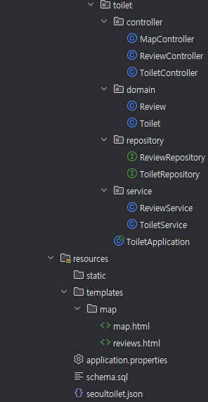
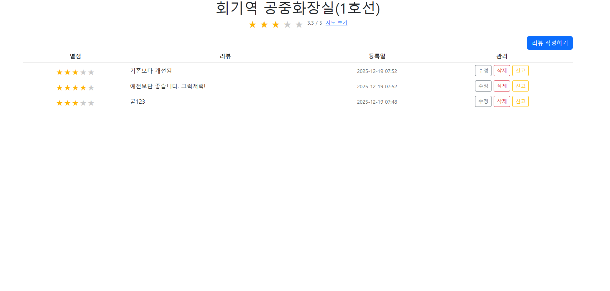
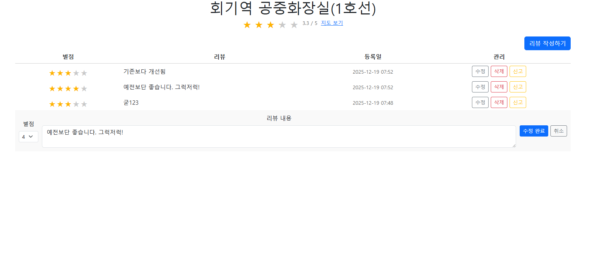
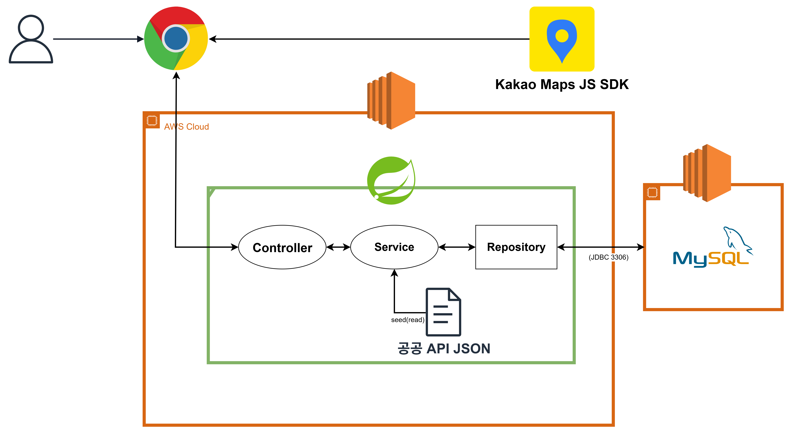

# Public Toilet Map (with 카카오 맵)

카카오 맵을 이용해 **서울시 공공 화장실 위치**를 시각화하고, 사용자가 **별점/리뷰**를 남길 수 있는 프로젝트입니다.  

## 스크린샷

<p align="center">
    
</p>

<p align="center">
    
</p>

<p align="center">
    
</p>

---

## 문제 정의

- 공공 화장실 정보가 분산돼 빠른 조회가 어렵고, 위치 외 품질 정보(평점/리뷰)가 부족함.

-  프로젝트 진행 중 리뷰 누적에 따라 평균 평점 집계가 느려져 응답 지연이 발생할 수 있음

### 해결

- 카카오 지도 기반으로 실시간 위치 렌더링으로 주변 공공 화장실을 시각화

- 리뷰/별점 기능을 통해 화장실 품질 정보를 시각화 및 사용성 증가

- 평점 집계를 그룹 쿼리로 최적화하고 캐시와 TTL로 응답 지연 및 DB 부하 줄임(read 기준)


## 핵심 기능

- 실시간 위치 기반 지도 렌더링 및 이동/줌 시 마커 갱신
 
- 줌 레벨 별 최대 히프 적용으로 Top-N 마커 제한(가까운 화장실 우선) + 타입별 마커 색상 구분
 
- 인포윈도우에서 평균 평점/리뷰 수 표시 및 리뷰 페이지 이동
 
- 리뷰 작성/수정/삭제, 신고 누적 차단, 금지어/스팸 제한

- 데이터 상태 배너
  - 지도 오른쪽 상단에서 로딩/성공/실패 및 화장실 수(줌 포함)를 보여주는 박스
  - 지도 왼쪽 상단에서 마커 색상(남/여/장애인/기타)을 설명하는 박스


## API 요약

- `GET /map`: 카카오 지도 화면
 
- `GET /toilets?withRatings=true`: 화장실 목록(+평점/리뷰 수 포함)
 
- `GET /reviews?toiletId={id}`: 특정 화장실 리뷰 목록/작성 화면
 
- `POST /reviews`: 리뷰 등록
 
- `POST /reviews/update`: 리뷰 수정

- `POST /reviews/delete`: 리뷰 삭제


## 아키텍처 구조

<p>
  
</p>


## 프로젝트 구조

```
src
 ├─ main
 │   ├─ java/com/example/toilet
 │   │   ├─ ToiletApplication.java
 │   │   ├─ controller
 │   │   │   ├─ MapController.java
 │   │   │   ├─ ReviewController.java
 │   │   │   └─ ToiletController.java
 │   │   ├─ dto
 │   │   │   ├─ ToiletSnapshot.java
 │   │   │   └─ ToiletView.java
 │   │   ├─ domain
 │   │   │   ├─ Review.java
 │   │   │   └─ Toilet.java
 │   │   ├─ repository
 │   │   │   ├─ ReviewRepository.java
 │   │   │   └─ ToiletRepository.java
 │   │   └─ service
 │   │       ├─ ReviewService.java
 │   │       └─ ToiletService.java
 │   └─ resources
 │       ├─ application.properties
 │       ├─ schema.sql
 │       ├─ seoultoilet.json
 │       └─ templates
 │           └─ map
 │               ├─ map.html
 │               └─ reviews.html
 └─ test
     └─ java/com/example/toilet
         ├─ CacheConsistencyMismatchTest.java
         ├─ CacheTtlPerfTest.java
         ├─ QueryCountProofTest.java
         ├─ QueryLogDiagnosticsTest.java
         ├─ RatingAggComparisonTest.java
         ├─ SlowQueryTestConfig.java
         ├─ ToiletListCacheComparisonTest.java
         └─ ToiletApplicationTests.java
```

- `dto`
  - `ToiletSnapshot`: 리스트 캐시용 스냅샷(엔티티 미사용)
  - `ToiletView`: API 응답용 DTO(평점/리뷰 수 포함)


## 화면 구성

### 1) 지도 화면 (`/map`)

- 카카오 지도 로드 후, 실시간 위치 갱신.

- `/toilets` API로 받은 JSON을 순회 후 마커 생성, 인포윈도우 내 평균 평점/리뷰 수 표시, 리뷰 페이지 이동 링크.

### 2) 리뷰 화면 (`/reviews?toiletId={id}`)

- 평균 별점 및 화장실 이름 표시.

- 리뷰 등록 폼(별점, 리뷰 입력), 등록/취소 버튼.

- 리뷰 목록 표(별점, 리뷰, 등록 날짜).


## 데이터 초기화

- 애플리케이션 시작 시 `seoultoilet.json` 파싱 후 DB 적재.

- `toilet` 테이블에 데이터가 있으면 건너 뜀.

- 실제 서비스에서는 최초 1회만 적재, 이후 DB 조회 수행.


## 성능

- 집계 방식
  - 리뷰 평균/개수를 N+1 방식 대신 그룹 집계로 계산
    - 서비스 호출 방식으로 per_toilet vs group 집계를 비교하며 캐시/TTL을 끈 상태에서 SQL 카운트와 agg/total 시간을 RUNS=100 으로 측정

| 구분              | 리스트 조회 횟수 | 집계 쿼리 횟수 |                 집계 연산 시간 |                 전체 응답 시간 |
| --------------- | --------: | -------: | -----------------------: | -----------------------: |
| 그룹 X (개별 집계)    |         1 |    4,557 | 895 ~ 946 ms (평균 934 ms) | 924 ~ 978 ms (평균 965 ms) |
| 그룹 O (GROUP BY) |         1 |        1 |     9 ~ 12 ms (평균 11 ms) |    38 ~ 43 ms (평균 40 ms) |

- 캐시 적용
  - 리스트 및 집계 결과를 캐시에 저장해 반복 조회를 줄임
    - 서비스 호출, 100회 반복, TTL = 60초, 랜덤 지연(0~200ms)+10% 확률로 3.5~4.5초 지연으로 테스트

| 구분        | 리스트 조회 횟수 | 집계 연산 횟수 | 캐시 히트 | 집계 연산 시간                       | 총 응답 시간                        |
| --------- | --------- | -------- | ----- | ------------------------------ | ------------------------------ |
| CACHE_OFF | 1         | 1        | 0     | 10.00 ~ 23.00 ms (평균 12.35 ms) | 38.52 ~ 58.28 ms (평균 44.71 ms) |
| CACHE_ON  | 0         | 0        | 100   | 0.00 ~ 0.00 ms (평균 0.00 ms)    | 0.12 ~ 0.54 ms (평균 0.36 ms)    |


- TTL 사용
  - 기본 5분 TTL로 만료 후 재집계하여 일관성 보완
    - 서비스 호출, 100회 반복, TTL = 60초(2nd) & 10초(3rd), 랜덤 지연(0~200ms)+10% 확률로 3.5~4.5초 지연으로 테스트

| 구분           | 리스트 조회 횟수 | 집계 연산 횟수 | 캐시 히트 | 집계 연산 시간                       | 전체 응답 시간                       |
| ------------ | --------- | -------- | ----- | ------------------------------ | ------------------------------ |
| 캐시 X         | 1         | 1        | 0     | 10.00 ~ 23.00 ms (평균 12.35 ms) | 38.52 ~ 58.28 ms (평균 44.71 ms) |
| 캐시 O         | 0         | 0        | 100   | 0.00 ~ 0.00 ms (평균 0.00 ms)    | 0.12 ~ 0.54 ms (평균 0.36 ms)    |
| TTL 만료 후 재집계 | 0         | 0        | 35    | 0.00 ~ 13.00 ms (평균 7.17 ms)   | 0.11 ~ 14.55 ms (평균 9.12 ms)   |


- 인터페이스 기반 DTO 프로젝션
    - 리스트 조회와 평점 집계에서 엔티티 전체를 반환하는 대신 인터페이스 기반 DTO 프로젝션을 적용해 필요한 컬럼만 조회/전송.

| TYPE(30회, 200개) |    전체 처리 시간 (ms)    | 페이로드 크기 |     메모리 사용량      | 결과 레코드 수 |
|:---------------:|:-------------------:|:-------:|:----------------:|:--------:|
|     리스트 엔티티     | 13~34 ms (평균 16 ms) | 1.55 MB | 11.4~12.0 MB (평균 11.5 MB) |  4,557   |
|    리스트 프로젝션     |  30~85 ms (평균 42 ms)   | 1.05 MB | 44.4~46.0 MB (평균 44.9 MB) |  4,557   |
|     평점 엔티티      |    2~6 ms (평균 4 ms)    |  173 B  | 0~2.6 KB (평균 171 KB) |    2     |
|     평점 프로젝션     |    2~5 ms (평균 3 ms)    |  69 B   | 0~2.6 KB (평균 18 KB) |    2     |


- 최대 히프 적용
  - 클라이언트 렌더링에서 Top-N로 히프 크기 제한하여 가까운 거리의 마커만 유지해서 정렬 비용과 렌더링 지연 줄임

| 구분                  | ALL SORT                          | N개 SORT                     | N개 HEAP                     |
| ------------------- | --------------------------------- | --------------------------- | --------------------------- |
| 전체 처리 시간 (Total)    | 334.30 ~ 390.80 ms (평균 362.13 ms) | 5.30 ~ 8.70 ms (평균 6.29 ms) | 4.60 ~ 7.20 ms (평균 5.10 ms) |
| 오버헤드 시간 (Overhead)  | 329.40 ~ 385.70 ms (평균 357.01 ms) | 3.50 ~ 7.90 ms (평균 5.64 ms) | 3.10 ~ 6.70 ms (평균 4.50 ms) |
| 거리 계산 시간 (Distance) | 4.60 ~ 5.40 ms (평균 5.12 ms)       | 0.40 ~ 1.00 ms (평균 0.65 ms) | 0.40 ~ 0.90 ms (평균 0.60 ms) |


- 클라이언트 렌더링 최적화
  - 지도 렌더링에서 전체 정렬 대신 최대 히프로 가까운 마커 N개 만 유지하여 연산량과 UI 지연 줄임
- 한계/향후 개선
  - 캐시 스탬피드 발생 가능
  - 분산 캐시 일관성 이슈
  - 트래픽 증가 시 single-flight/락 또는 외부 캐시 적용 검토
    - single-flight: 동시에 같은 데이터 요청이 몰리면, 첫 요청만 실제 작업하고 나머지는 결과 공유
    - 락: 특정 키에 대해 한 번에 하나의 요청만 처리하고, 나머지는 대기

---

## 테스트

- `ToiletApplicationTests`
  - Spring 컨텍스트 로딩 스모크 테스트


## 기술 스택


## 프로젝트 보기
- [공공 화장실 맵 프로젝트 시연 보기](https://youtu.be/srk0vQrEu9E)

## AWS EC2 & RDS
- http://3.36.128.192:8080/map (종료됨)
